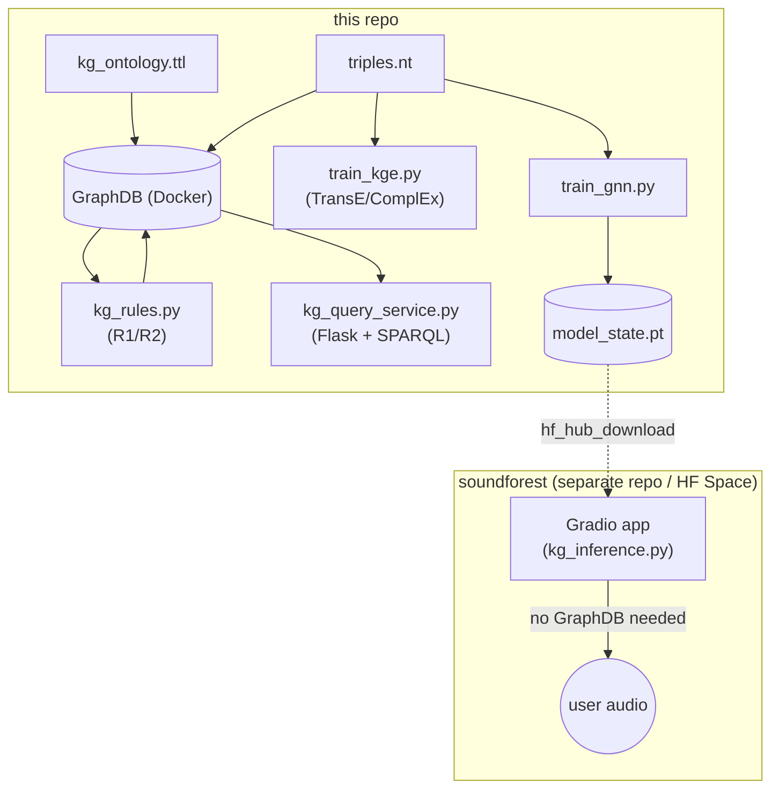
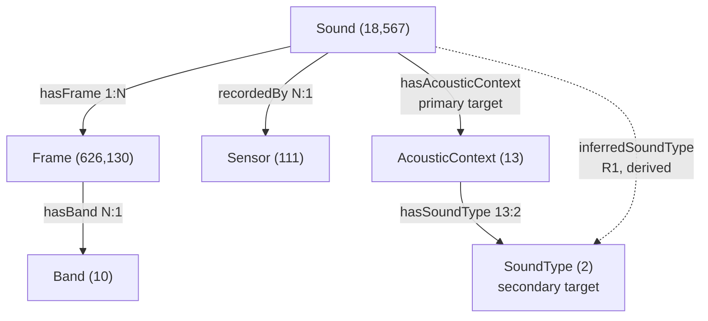

# FOREST-KG ( work-in-progress )

Knowledge Graph layer for the FOREST soundscape pipeline: merges urban
(SONYC-UST) and forest (Costa Rica PSA) recordings into one RDF graph,
with rule-based inference, KG embeddings (TransE/ComplEx), and a GNN,
compared on the same classification task. Full write-up in the course
portfolio report.

Further development of the [Hearing the FOREST](https://doi.org/10.34726/hss.2025.126900)
diploma thesis ( TU Wien ).

Live demo on : [www.soundforest.app](https://www.soundforest.app/)

## System Architecture



GraphDB and the KGE/ComplEx models stay local to this repo. Only the
trained GNN weights leave it — pushed to the HF Model Hub and pulled by
the separate [www.soundforest.app](https://www.soundforest.app/) app, which runs
inference standalone, no GraphDB connection required at request time.

## Knowledge Graph Data-Schema

One `Sound` per recording, owning its one-second `Frame` windows. Frame
carries the 17 real acoustic indices; Sound/Sensor/Band start from
uninformative seed vectors, so classification skill has to come from
message passing over Frames.



## Data Transformation Pipeline

1. `build_kg_triples.py` — `out/data/extraction/*.pkl` → `out/data/kg/triples.nt` (N-Triples, parallel)
2. `load_kg.py` — load `kg_ontology.ttl` + `triples.nt` into GraphDB
3. `kg_rules.py` — R1/R2 rule inference (SPARQL Update, run against GraphDB)
4. `train_kge.py` / `train_gnn.py` — link prediction / node classification, read `triples.nt` directly (no GraphDB needed)
5. `kg_query_service.py` — SPARQL analytics service (CLI or Flask), reads GraphDB


`gnn_inference.py` and `kg_inference.py` are superseded standalone inference models deployed on  [www.soundforest.app](https://www.soundforest.app/).

## Setup

```bash
conda create -n tpyforest python=3.11 -y
conda activate tpyforest
pip install -r kg/requirements.txt
```

`flask` is only needed for `kg_query_service.py --serve`; everything else
runs fine without it. GraphDB itself needs Docker.

## Running

```bash
docker compose -f kg/graphdb-docker-compose.yml up -d
python kg/build_kg_triples.py --workers 19
python kg/load_kg.py --recreate
python kg/kg_rules.py
python kg/train_gnn.py
python kg/train_kge.py --sample-fraction 0.3 --models transe
python kg/kg_query_service.py --list
```

## FOREST-KG Preliminary Results

TransE vs. GNN, same stratified train/test split (primary = AcousticContext
13-way, secondary = SoundType 2-way):

| Model | Data | Time | Primary (top-1 / top-3) | Secondary (top-1) |
|---|---|---|---|---|
| TransE | 30% | 43.1 min | 0.099 / 0.403 | 0.990 |
| GNN | 30% | 2.0 min | 0.444 / 0.748 | 1.000 |
| **GNN** | **100%** | **5.9 min** | **0.459 / 0.754** | **1.000** |

The GNN performs better because it directly uses the content of each frame, rather than relying only on graph structure.
This also allows it to process previously unseen recordings, while KGE models rely on fixed embeddings for known entities. 
Therefore, the deployed application uses the GNN (default).

## Previous Work (FOREST): CNN-LSTM Models Final Results

Before the Knowledge Graph layer, the original FOREST thesis trained seven (7) models on
the four (4) AcousticContext Regions (FOREST: Reference Forest, Pasture, Natural
Regeneration, Plantation. Thus, NO SONYC-UST Urban audio), ablating over **511 feature
combinations** per model (16 total features: 7 fixed statistical + 9 candidate EAIs), for
**3,577 training runs** total and 11-epochs.

For more details, please consult the [FOREST Thesis Manuscript HERE](https://doi.org/10.34726/hss.2025.126900) .

| Model | Family | Best AC (10–13 features) | Notes |
|---|---|---|---|
| **ParaNet-CNN-LSTM** | Hybrid (parallel CNN + LSTM) | Median >90%, max >97.5% | Most stable/robust; selected as final model |
| SeqNet-LSTM-CNN | Hybrid (sequential) | Peak >98% at 13 features | Highest single peak, but less consistent |
| SeqNet-CNN-LSTM | Hybrid (sequential) | ~96% at best | Below the top two |
| Simple-CNN | Baseline | ~96% at best | Strong for its simplicity |
| Simple-LSTM | Baseline (SOTA) | Lower, high variance | Excluded from final feature-ablation |
| ResNet1D | Baseline (SOTA, 1D-adapted) | Lower, high variance | 2D-image-classification origin generalises poorly to 1D audio |
| Simple-SVM | Baseline (SOTA) | Lowest | Linear d null ecision boundary insufficient for this feature space |

**Optimal: 12 features (7 fixed + 5 EAIs )** : Number of Peaks (NPP), Bioacoustic
Index (BET), Temporal Entropy (HTP), Acoustic Evenness Index (AEI), Frequency
Entropy (HFQ), results beyond 13 bring little-to-none improvement.

**ParaNet-CNN-LSTM + 12 features is the Final Model**, distinct from the KG-GNN work above (4-way
FOREST-only vs. 13-way Urban-AcousticContext).

## Data & Model Availability

This git-repo: [github.com/carlosvargas9103/soundforest](https://github.com/carlosvargas9103/soundforest) · Demo: [www.soundforest.app](https://www.soundforest.app/)

Zenodo: [Vargas Rivera, Carlos Alberto](https://zenodo.org/search?q=metadata.creators.person_or_org.name:%22Vargas%20Rivera,%20Carlos%20Alberto%22) · ORCID: [0000-0002-1757-3249](https://orcid.org/0000-0002-1757-3249)

| Artifact | Size | Status | Link |
|---|---|---|---|
| `out/data/kg/triples.nt` | 2.4 GB | Zenodo | [FOREST-KG Triples Curated Dataset](https://zenodo.org/records/23105337) |
| Trained model weights (`kge/`, `gnn/`, `gnn_full/`) | ~25–50 MB each | Pending | FOREST-KG KGE/GNN Models & Performance |
| CNN-LSTM results (`out/data/modelling/*.csv`, 3,577-run summaries) | 37 MB | Zenodo | [FOREST Models Performance](https://zenodo.org/records/17254027) |
| `out/data/extraction/*.pkl` (curated feature dataset) | 30 GB | Zenodo | [FOREST Curated Dataset](https://zenodo.org/records/17070625) |
| Raw SONYC-UST audio | 18 GB | Zenodo<br/>(New York University) | [FOREST-KG Raw SONYC-UST Audios](https://zenodo.org/records/3966543) |
| Raw PSA forest recordings | 6.1 TB | Zenodo<br/>(ETH Zürich) | [Costa Rica Acoustic Monitoring Dataset – Nicoya](https://www.research-collection.ethz.ch/entities/researchdata/e25c4a99-6df8-493c-8df3-9141027b4f63) |
| Further audio integration (planned) | -- | Nature | [Acoustic measurements from soundscapes collected worldwide during the COVID-19 pandemic](https://www.nature.com/articles/s41597-024-03611-7) |