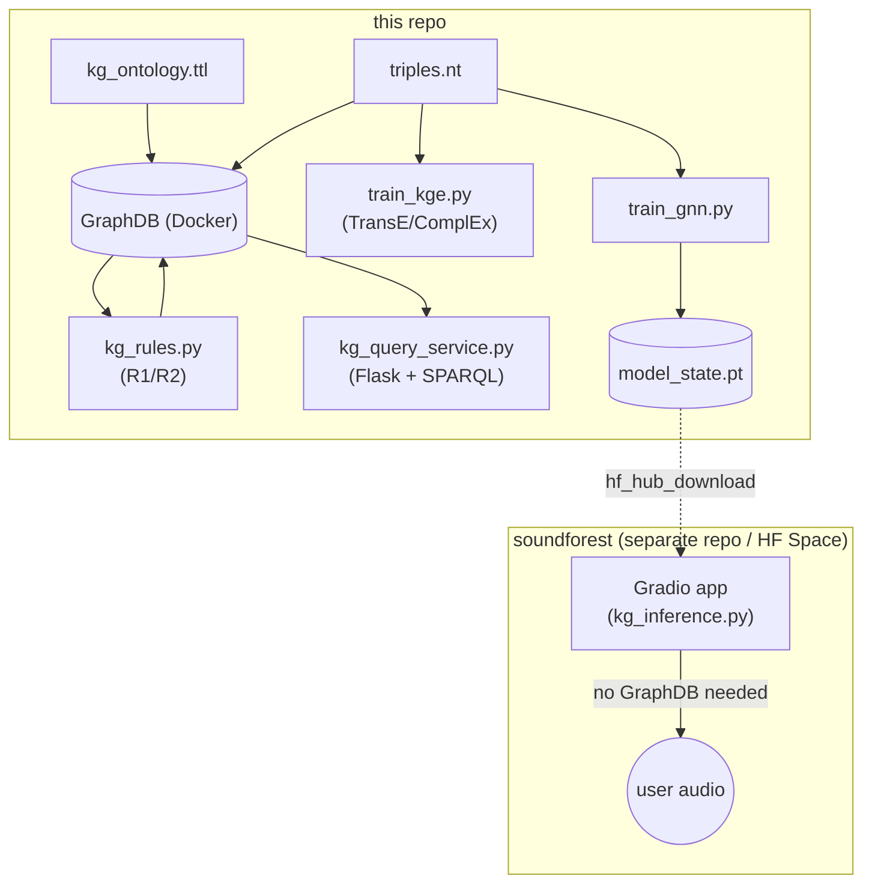
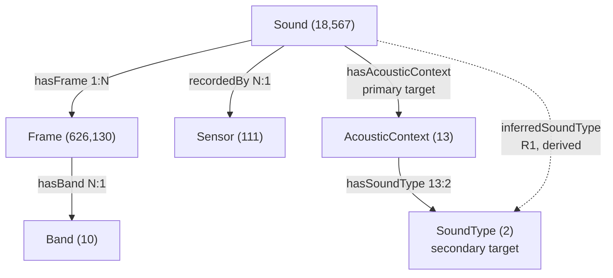
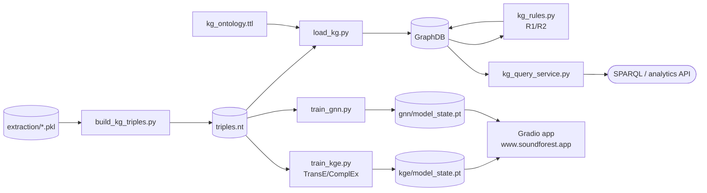

# FOREST-KG ( work-in-progress )

Knowledge Graph layer for the FOREST soundscape pipeline: merges urban
(SONYC-UST) and forest (Costa Rica PSA) recordings into one RDF graph,
with rule-based inference, KG embeddings (TransE/ComplEx), and a GNN,
compared on the same classification task. Full write-up in the course
portfolio report.

Further development of the [Hearing the FOREST](https://doi.org/10.34726/hss.2025.126900)
diploma thesis (TU Wien). Live demo: [www.soundforest.app](https://www.soundforest.app/).

## Architecture



GraphDB and the KGE/ComplEx models stay local to this repo. Only the
trained GNN weights leave it — pushed to the HF Model Hub and pulled by
the separate [www.soundforest.app/](https://www.soundforest.app/) app, which runs
inference standalone, no GraphDB connection required at request time.

## Schema

One `Sound` per recording, owning its one-second `Frame` windows. Frame
carries the 17 real acoustic indices; Sound/Sensor/Band start from
uninformative seed vectors, so classification skill has to come from
message passing over Frames.



## Pipeline

1. `build_kg_triples.py` — `out/data/extraction/*.pkl` → `out/data/kg/triples.nt` (N-Triples, parallel)
2. `load_kg.py` — load `kg_ontology.ttl` + `triples.nt` into GraphDB
3. `kg_rules.py` — R1/R2 rule inference (SPARQL Update, run against GraphDB)
4. `train_kge.py` / `train_gnn.py` — link prediction / node classification, read `triples.nt` directly (no GraphDB needed)
5. `kg_query_service.py` — SPARQL analytics service (CLI or Flask), reads GraphDB



`gnn_inference.py` and `kg_inference.py` are superseded standalone inference models deployed on  [www.soundforest.app](https://www.soundforest.app/).

## Setup

```bash
conda create -n tpyforest python=3.11 -y
conda activate tpyforest
pip install -r kg/requirements.txt
```

`flask` is only needed for `kg_query_service.py --serve`; everything else
runs fine without it. GraphDB itself needs Docker.

## Running

```bash
docker compose -f kg/graphdb-docker-compose.yml up -d
python kg/build_kg_triples.py --workers 19
python kg/load_kg.py --recreate
python kg/kg_rules.py
python kg/train_gnn.py
python kg/train_kge.py --sample-fraction 0.3 --models transe
python kg/kg_query_service.py --list
```

## Preliminary Results

TransE vs. GNN, same stratified train/test split (primary = AcousticContext
13-way, secondary = SoundType 2-way):

| Model | Data | Time | Primary (top-1 / top-3) | Secondary (top-1) |
|---|---|---|---|---|
| TransE | 30% | 43.1 min | 0.099 / 0.403 | 0.990 |
| GNN | 30% | 2.0 min | 0.444 / 0.748 | 1.000 |
| **GNN** | **100%** | **5.9 min** | **0.459 / 0.754** | **1.000** |

The GNN performs better because it directly uses the content of each frame, rather than relying only on graph structure.
This also allows it to process previously unseen recordings, while KGE models rely on fixed embeddings for known entities. 
Therefore, the deployed application uses the GNN (default).